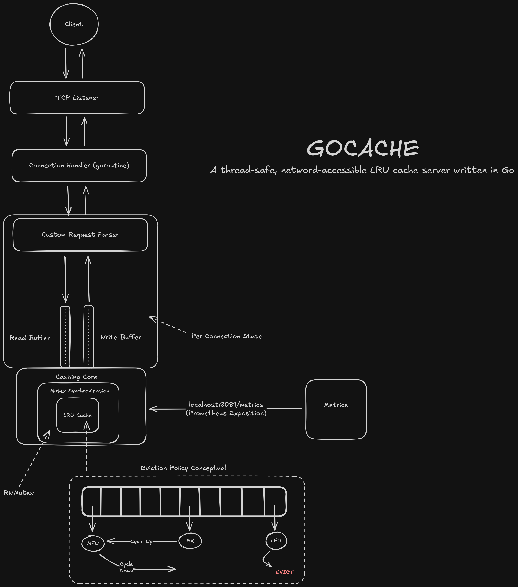

# GoCache

A thread-safe, network-accessible LRU cache server written in Go.

## Overview


GoCache is a from-scratch implementation of a distributed cache system featuring:
- **LRU eviction policy** - Automatically removes least recently used items when at capacity
- **Thread-safe operations** - Handles concurrent access from multiple clients
- **TCP network protocol** - Remote access via simple text commands
- **O(1) operations** - Constant-time get, set, and delete operations

## Architecture

GoCache combines two data structures for optimal performance:
- **Hash map** - O(1) key lookups
- **Doubly-linked list** - O(1) insertion, deletion, and LRU ordering

```
Client → TCP Server → Cache (Hash Map + Doubly-Linked List)
```

When the cache reaches capacity, it automatically evicts the least recently used item. Every `Get()` or `Set()` operation moves the accessed item to the "most recent" position.

## Getting Started

### Prerequisites

* [Go 1.21+](https://go.dev/dl/)

### Installation

1. Clone the repository:
   ```bash
   git clone https://github.com/BlaiseLM/gocache.git
   cd gocache
   ```

2. Run tests to verify installation:
   ```bash
   go test -v
   ```

### Running the Server

Start the cache server:
```bash
go run server.go
```

The server will listen on `localhost:8080` by default.

### Usage

Connect to the server using `nc` (netcat) or `telnet`:

```bash
nc localhost 8080
```

**Available Commands:**

```
SET key value    # Store a key-value pair
GET key          # Retrieve a value by key
DELETE key       # Remove a key-value pair
FLUSH            # Clear entire cache
END              # Close connection
```

**Example Session:**

```bash
$ nc localhost 8080
SET user:1 alice
OK
GET user:1
alice
GET user:2
(nil)
SET user:2 bob
OK
DELETE user:1
OK
END
Closing connection
```

## Testing

Run the test suite:
```bash
go test -v
```

Run with race detection to verify thread safety:
```bash
go test -race
```
