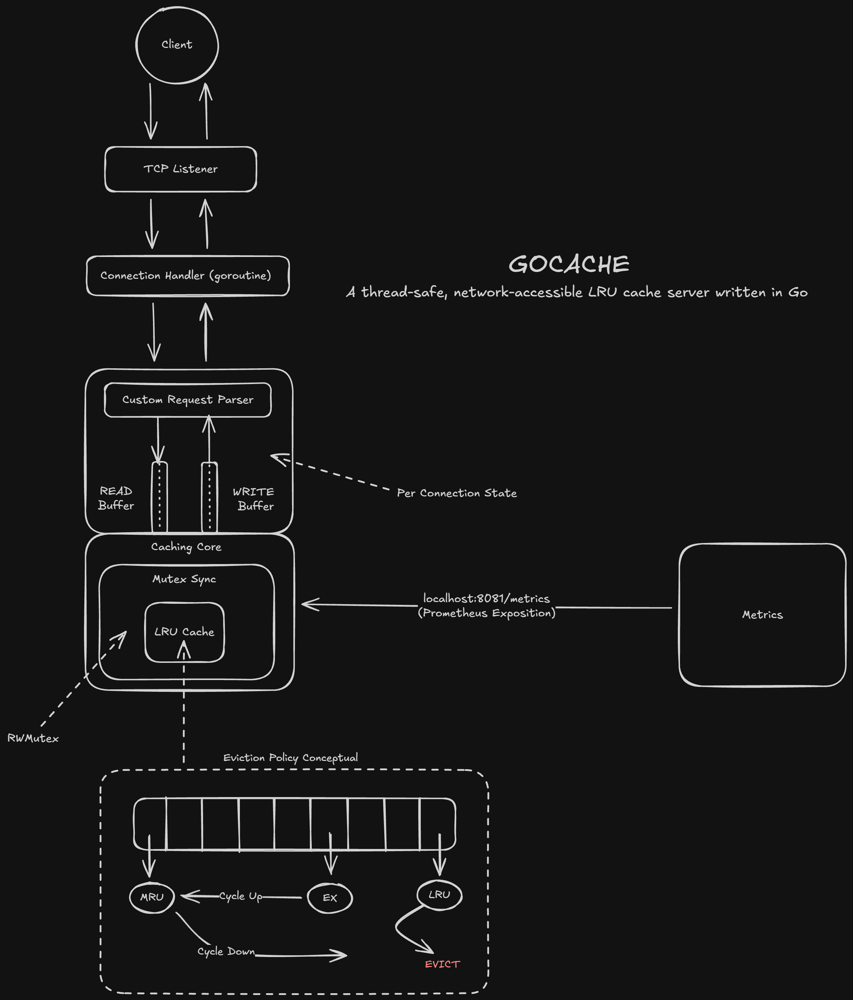

# GoCache

A thread-safe, network-accessible LRU cache server written in Go.

## Overview


GoCache is a from-scratch implementation of an in-memory cache system featuring:
- **LRU eviction policy** - Automatically removes least recently used items when at capacity
- **Thread-safe operations** - Handles concurrent access from multiple clients
- **TCP network protocol** - Remote access via simple text commands
- **Prometheus metrics** - Exposes cache metrics for monitoring
- **Grafana dashboards** - Real-time visualization of cache performance
- **O(1) operations** - Constant-time get, set, and delete operations

## Architecture

GoCache combines two data structures for optimal performance:
- **Hash map** - O(1) key lookups
- **Doubly-linked list** - O(1) insertion, deletion, and LRU ordering

```
Client → TCP Server → Cache (Hash Map + Doubly-Linked List)
```

When the cache reaches capacity, it automatically evicts the least recently used item. Every `Get()` or `Set()` operation moves the accessed item to the "most recent" position.

## Benchmarks

**Test Environment:**
- OS: Linux (amd64)
- CPU: Intel Core Ultra 7 155H
- RAM: 32GB
- Go version: 1.21+
- Cache capacity: 1024 keys

**Average Time per Operation:**

| Operation | Average Time |
|-----------|--------------|
| Get (hit) | ~125 ns/op |
| Get (miss) | ~145 ns/op |
| Set (eviction) | ~400 ns/op |
| Concurrent workload | ~370 ns/op |

**Hit Rate:**

| Scenario | Keys | Workers | Requests | Target Hit Rate | Actual Hit Rate | Notes |
|----------|------|---------|----------|----------|--------|-------|
| Accuracy | 512 (50% capacity) | 20 | 100,000 | 80% | **79.93%** | Baseline accuracy |
| Evictions | 1,100 (107% capacity) | 20 | 100,000 | 80% | **74.31%** | Under eviction pressure |
| Concurrency | 750 (73% capacity) | 50 | 100,000 | 80% | **80.16%** | High concurrency |

*All scenarios ran for 5 minutes with 15-second Prometheus scrape intervals (20 data points)*

## Getting Started

### Prerequisites

* [Docker](https://www.docker.com/) and [Docker Compose](https://docs.docker.com/compose/) installed on your system
* Alternatively, [Go 1.21+](https://go.dev/dl/) if running locally without Docker

### Installation

1. Clone the repository:
   ```bash
   git clone https://github.com/BlaiseLM/gocache.git
   cd gocache
   ```

2. Build the Docker images & run the services (in detached mode):
   ```bash
   docker compose up --build -d 
   ```
3. Verify the services:
   - Cache server: `localhost:8080`
   - Prometheus metrics: `localhost:8081/metrics`
   - Prometheus dashboard: `localhost:9090`
   - Grafana dashboard: `localhost:3000`

### Running the Server Locally

If you prefer to run the server without Docker:
```bash
go run server.go
```
The server will listen on `localhost:8080` by default. Prometheus metrics will be available at `localhost:8081/metrics`.

### Usage

Connect to the server using `nc` (netcat) or `telnet`:

```bash
nc localhost 8080
```

**Available Commands:**

```
SET key value    # Store a key-value pair
GET key          # Retrieve a value by key
DELETE key       # Remove a key-value pair
FLUSH            # Clear entire cache
END              # Close connection
```

**Example Session:**

```bash
$ nc localhost 8080
SET user:1 alice
OK
GET user:1
alice
GET user:2
(nil)
SET user:2 bob
OK
DELETE user:1
OK
GET user:1
(nil)
FLUSH
OK
GET user:2
(nil)
END
Closing connection
```

## Protocol Details

For important details about the server's protocol and its compatibility with tools like `telnet`, see the [Protocol Documentation](docs/protocol.md).

## Monitoring and Benchmarking

### Quick Start

1. **Start all services:**
```bash
   docker compose up -d
```

2. **Verify services are running:**
```bash
   docker ps
```

   You should see containers for:
   - Cache server (ports 8080, 8081)
   - Prometheus (port 9090)
   - Grafana (port 3000)

3. **Access the dashboards:**
   - Prometheus dashboard: `localhost:9090`
   - Grafana dashboard: `localhost:3000`

### Setting Up Hit Rate Monitoring

#### Option 1: Prometheus Dashboard (Simple)

1. Navigate to `localhost:9090/query`
2. Enter this PromQL query:
```promql
   (total_cache_hits / (total_cache_hits + total_cache_misses)) * 100
```
3. Click "Execute" to see the current hit rate

#### Option 2: Grafana Dashboard (Recommended)

1. Navigate to `localhost:3000`
2. Create a new dashboard
3. Select Prometheus as data source
4. Select "Time series" visualization
5. Toggle "Code"
6. Add the same PromQL query:
```promql
   (total_cache_hits / (total_cache_hits + total_cache_misses)) * 100
```
7. Click "Run queries"

### Running Load Tests

1. **Start the load generator:**
```bash
   ./load_generator.sh -k 1000 -w 20 -h 0.8 -d 300
```

   This runs for 5 minutes (300 seconds) with:
   - 1000 keys
   - 20 concurrent workers
   - 80% target hit ratio

2. **Verify metrics are updating:**
   - Check `localhost:8081/metrics`
   - Look for `total_cache_hits` and `total_cache_misses` incrementing

3. **Watch the hit rate graph:**
   - In Prometheus (localhost:9090) or Grafana (localhost:3000)
   - The graph will update as the script runs
   - With Prometheus scraping every 15 seconds, a 5-minute test provides 20 data points

**Note:** Running tests for at least 5 minutes is recommended to get sufficient data points (20+) for accurate hit rate calculations.

### Example Test Scenarios

The benchmark results in this README were generated using:

**Baseline accuracy:**
```bash
./load_generator.sh -k 512 -w 20 -h 0.8 -d 300
```

**Under eviction pressure:**
```bash
./load_generator.sh -k 1100 -w 20 -h 0.8 -d 300
```

**High concurrency:**
```bash
./load_generator.sh -k 750 -w 50 -h 0.8 -d 300
```

## Testing

Run the test suite:
```bash
go test -v
```

Run with race detection to verify thread safety:
```bash
go test -race

```

## Community Suggested Improvements
- [ ] Sentinel errors
- [ ] Decouple metrics from cache struct